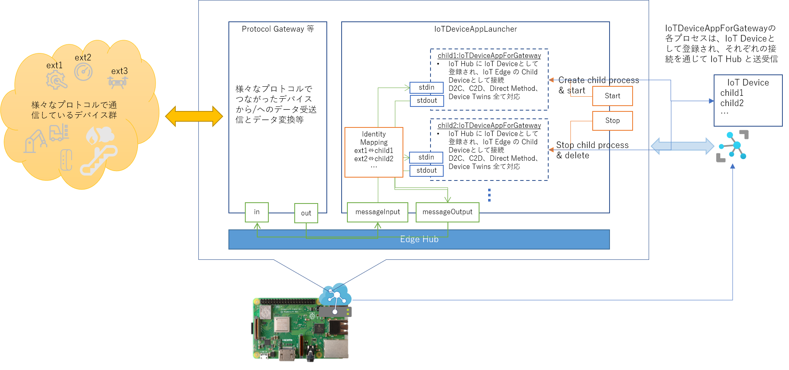

# IoT Edge Module 内での IoT Device 制御  
Transparent Gateway を使った、Protocol Gateway のひな型サンプルを紹介する。  
業界標準プロトコルで通信しあう既存の設備機器や、HWレベルのワイヤード接続されたデバイス群、Bluetooth通信しているデバイス群があるとする。それら設備機器やデバイスを適度な粒度で分割し、それぞれを Azure IoT Hub に IoT Device として登録し、それぞれのプロトコルで相互通信している設備機器・デバイス群と Azure IoT Edge 上で動いている Azure IoT Edge Module がそれぞれのプロトコルで通信し、その Azure IoT Edge Module 内で、Azure IoT Hub との送受信の形式に双方向変換してやれば、独自プロトコルで相互通信している機器・デバイス群と、クラウド上のサービス間で双方向通信が可能な基盤を容易に構築できる。  
加えて、それぞれの設備機器・デバイスに対し、管理用のメタデータや制御設定データを、Device Twins を用いた、保持・更新の通知・参照する仕組みも容易に構築できる。追加のDBやFunctions等が不必要なので、運用コスト面でも有利である。  
更に、IoT Edge の Transparent Gateway 機構を使って、各設備機器・デバイスに対応する IoT Device と Azure IoT Hub の通信は、Azure IoT Edge を Gateway として集約されるため、物理回線上の、接続数も1つで済む。  
Protocol 変換ロジックは、当然ながら、それぞれの Protocol 毎に異なるロジックを用意しなければならないが、複数の設備機器・デバイスが IoT Device として IoT Hub と相互通信する部分は、パターン化できる。  
そのようなパターン化した IoT Edge Module のサンプルを提供する。構成は以下の通り。




---
## Azure IoT Edge Module Build と Deploy
root.ca.cert.pem ファイルを、MultiIoTDeviceAppsInGatewayEdge/IoTDeviceAppInGatewayEdge にコピーする。  
MultiIoTDeviceAppsInGatewayEdge ディレクトリで、以下を実行する。  
```
$ sudo docker build -t iotdevapplauncher -f Dockerfile.arm32v7 .
$ sudo docker tag iotdevapplauncher youracrserver/iotdevapplauncher:1.0.0-arm32v7
$ sudo docker push youracrserver/iotdevapplauncher:1.0.0-arm32v7
```
※ <i><b>youracrserver</b></i> は各自の Azure Container Registry の URL、もしくは、Docker Hub のユーザーアカウント名   

Azure Portal で、Azure IoT Edge Module として Deploy 指定する。Container Create Options を以下の様に設定する。  
```json
{
  "Config": {
    "OpenStdin": true
  }
}
```
※ 子プロセスの Standard Input、Standard Output を使って親プロセスと通信するために必要な設定らしいよ。  

## IoT Device のプロビジョニング  
Deploy した Module の Direct Method を Invoke してIoT Device をプロビジョニングする。  

関数名： Start  
Payload：
```json
{
  "LaunchCommand": "./iotapp/IoTDeviceAppForGatewayEdge",
  "HostName": "youriothub.azure-devices.net",
  "DeviceId": "nested-child-app-1",
  "SharedAccessKey": "該当する Shared Access Key",
  "GatewayHostName": "IoT Edge が動いている Raspberry Pi の IP アドレス",
  "TrustedCACertPath": "./iotapp/azure-iot-test-only.root.ca.cert.pem"
}
```
Stop という Direct Method をコールすると、停止＆削除  

## 別プロトコル側と IoTAppForGatewayEdge との相互通信  
